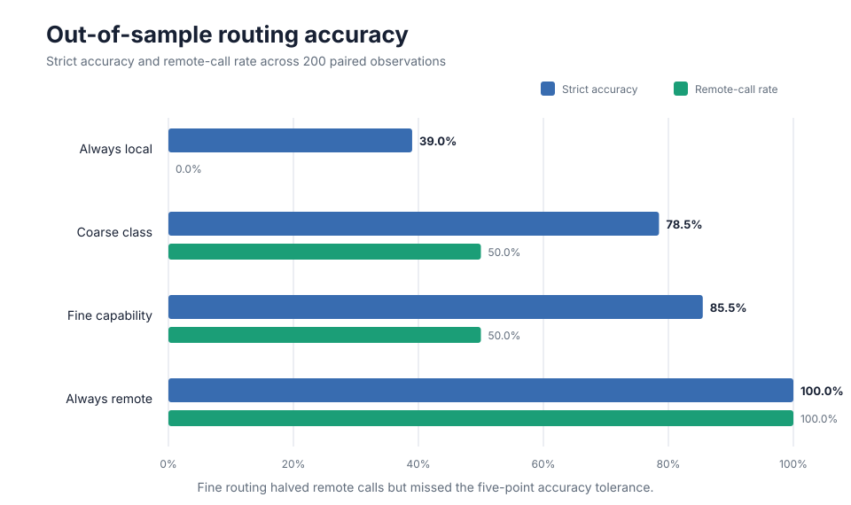
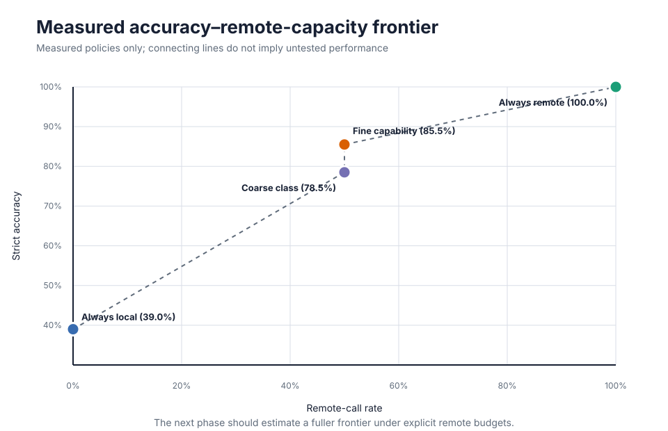
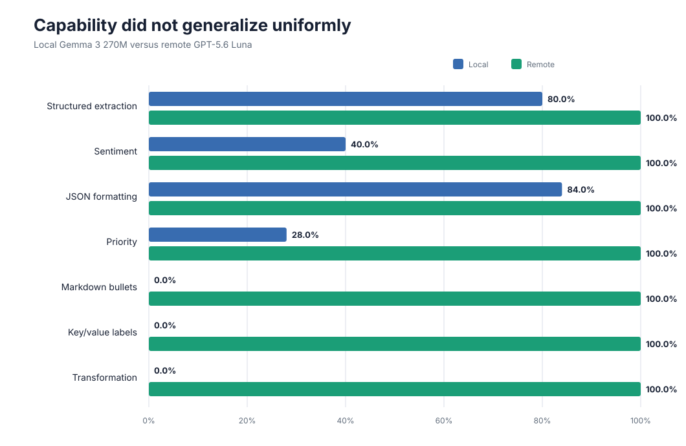

# Can a Tiny Local Model Reliably Reduce Remote AI Demand?

## A reproducible negative result in capability-based model routing

A fine-grained routing policy cut remote model calls in half and performed
better than coarse task-class routing. It nevertheless failed its
out-of-sample success criterion because previously promising local
capabilities did not generalize reliably.

This case study reports that failure rather than optimizing it away.



## Research question

Can explicitly identified mechanical tasks be routed to a very small local
model while preserving performance close to an accurate remote model?

The wider motivation is resilience. Remote inference is currently inexpensive,
but increasing dependence on centralized AI infrastructure could make price,
capacity, latency, or availability constraints more important. This experiment
does not claim that such scarcity has already occurred. It tests one component
needed for operating under it: selective use of local compute.

The preregistered pilot criterion required the fine routing policy to:

1. use exactly 100 rather than 200 remote calls; and
2. finish no more than five percentage points below always-remote accuracy.

## System under test

The experiment paired:

- local model: Gemma 3 270M through Ollama;
- remote model: GPT-5.6 Luna through OpenRouter;
- 40 new deterministic tasks;
- five local and five remote repetitions per task;
- 200 paired task/repetition observations;
- seven pre-labelled capability families;
- deterministic validators rather than an LLM judge.

The frozen fine policy routed these families locally:

- structured extraction;
- sentiment classification;
- JSON formatting.

It routed these families remotely:

- priority classification;
- Markdown bullets;
- key/value labels;
- deterministic transformations.

Routing used the supplied capability-family label. It did not automatically
infer the family from an arbitrary user prompt.

## Experimental controls

Before execution, the project froze the task suite, prompts, expected outputs,
validators, model settings, routing policy, and execution runner.

The benchmark identity was:

```text
SHA-256:
6e255b2d44599f49a1cda82f989b110a015c16c55da54ea6501f4b8cb18fa295

```

The evidence retained raw outputs, failures, empty outputs, errors, telemetry,
model identity, validator results, reported remote usage, and cost. There were
no automatic retries and no post-run semantic repair.

Repetitions of one task were not treated as independent tasks. Uncertainty was
examined with a paired task-cluster bootstrap that resampled the 40 tasks while
retaining their five repetitions.

## Results

| Policy | Strict passes | Accuracy | Remote calls |
|---|---:|---:|---:|
| Always local | 78/200 | 39.0% | 0 |
| Coarse task class | 157/200 | 78.5% | 100 |
| Fine capability | 171/200 | 85.5% | 100 |
| Always remote | 200/200 | 100.0% | 200 |

Fine capability routing improved accuracy by seven percentage points over
coarse routing at the same 50% remote-call rate. It still finished 14.5
percentage points below always remote and therefore failed the five-point
tolerance.

The paired task-cluster bootstrap estimate for fine routing minus always remote
was -14.5 percentage points, with a descriptive percentile 95% interval from
-25.0 to -5.5 percentage points.

This interval is sensitivity analysis, not a formal non-inferiority result.



## Where the policy failed

Local capability varied sharply by family:

| Capability family | Local | Remote |
|---|---:|---:|
| Structured extraction | 40/50 | 50/50 |
| Sentiment | 10/25 | 25/25 |
| JSON formatting | 21/25 | 25/25 |
| Priority | 7/25 | 25/25 |
| Markdown bullets | 0/25 | 25/25 |
| Key/value labels | 0/25 | 25/25 |
| Transformation | 0/25 | 25/25 |



The fine policy incurred 29 failures among tasks selected for local execution:

- Sentiment caused 15 failures. The prompts explicitly defined Positive,
  Negative, and Neutral, but the local model frequently returned Neutral for
  clearly evaluative statements.
- Structured extraction caused 10 failures. These included returning `"42"`
  instead of numeric `42`, and `temperature` instead of the required
  `temperature_c`.
- JSON formatting caused four failures by returning port `"8443"` as a string
  rather than the supplied numeric value.

These were cleanly generated but incorrect answers. Runtime measurements such
as RAM, swap activity, latency, and generation rate could not identify them in
advance.

That distinction matters: operational health telemetry can show whether local
inference is struggling to run, but it does not by itself establish semantic
correctness.

## Cost and latency observations

Reported OpenRouter cost was:

- always remote: USD 0.00664640;
- fine routing: USD 0.00321820.

Fine routing reduced reported remote cost by approximately 51.6%, but the
absolute saving was tiny and came with an unacceptable accuracy loss.

Measured median selected total time was:

- always remote: 1,690.078 ms;
- fine routing: 1,115.469 ms.

These measurements do not establish energy savings. Remote-call count,
monetary cost, latency, and sequential work time are not substitutes for direct
energy measurement.

## What the experiment establishes

The result supports four conclusions:

1. Fine capability distinctions were more useful than coarse task classes.
2. A fixed family-level policy was still too broad to preserve accuracy.
3. Strong in-sample performance in a capability family did not guarantee
   out-of-sample generalization.
4. Deterministic validation exposed exact failures that runtime telemetry
   could not predict.

The current policy should therefore be rejected, not deployed.

## What it does not establish

This experiment does not demonstrate:

- reliable automatic routing of arbitrary user prompts;
- performance on a natural production workload;
- general results for all local or remote models;
- that a 1B–4B local model would fail similarly;
- that local routing beats an inexpensive small remote model;
- present or future remote-inference scarcity;
- measured energy reduction.

The 40 tasks were newly constructed but came from the same project taxonomy.
They are out of sample relative to policy construction, not an external sample
of ordinary user demand.

## Next experiment

The next phase should treat routing as constrained optimization:

> Under a fixed remote-call budget, what is the highest task success rate that
> can be achieved?

Instead of testing one arbitrary 50/50 split, remote capacity should be swept
from 0% to 100%. The experiment should compare several local model sizes and
include an inexpensive remote baseline.

The resulting object is an accuracy–remote-capacity frontier. Price
multipliers, failure costs, retries, and remote availability can then be
simulated transparently without pretending that future infrastructure
conditions are already known.

## Reproduction and evidence

The repository contains:

- the preregistered plan: [`OOS_VALIDATION_V1_PLAN.md`](OOS_VALIDATION_V1_PLAN.md);
- the complete audit: [`OOS_VALIDATION_V1_AUDIT.md`](OOS_VALIDATION_V1_AUDIT.md);
- frozen strict analysis: [`routing_analysis_oos_v1.json`](routing_analysis_oos_v1.json);
- deterministic chart generator: [`build_case_study_charts.py`](build_case_study_charts.py);
- chart tests: [`tests/test_case_study_charts.py`](tests/test_case_study_charts.py);
- preserved local and remote JSONL evidence.

The analysis discloses two procedural deviations:

1. the OOS-specific analysis code was not committed before model execution;
2. the preregistration specified a fixed bootstrap seed but did not record its
   numeric value before collection.

Neither deviation changed the frozen observations or strict point estimates,
but both limit any claim of fully code-preregistered statistical analysis.
