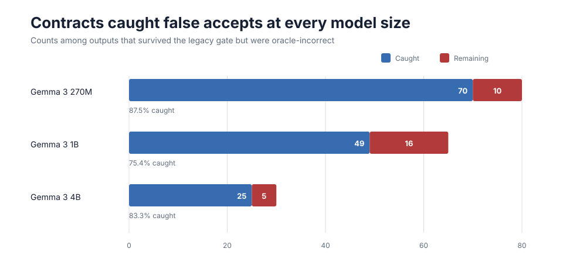
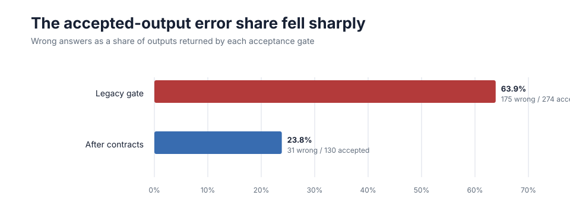
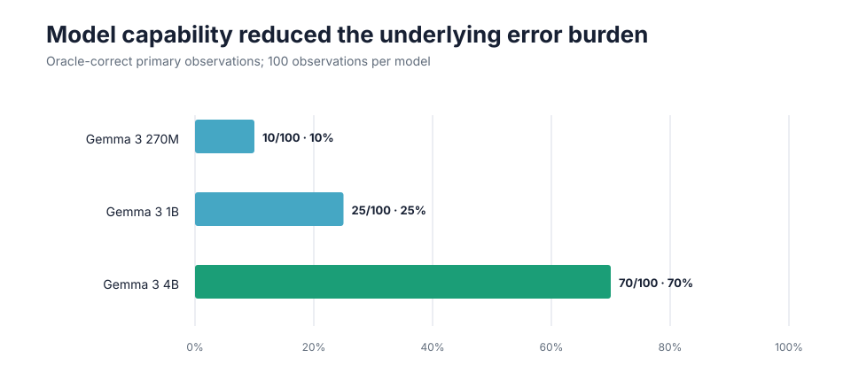
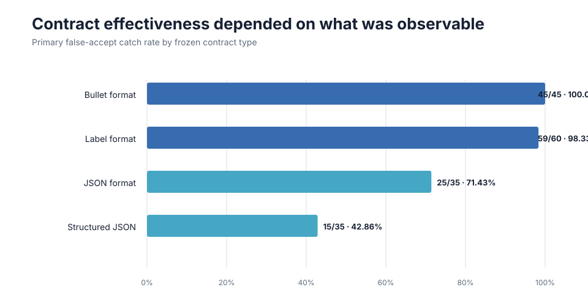

# Deterministic Contracts Caught Most Wrong Answers the Router Accepted

## A prospective validation across three local model sizes

Across 300 prospectively specified primary observations, deterministic output
contracts caught 144 of 175 false accepts admitted by the Adaptive Router's
legacy gate: **82.3%**, with a task-cluster bootstrap 95% interval of
**63.9%–96.7%**.

No baseline-correct survivor was rejected. Among accepted outputs, the
wrong-answer share fell from **63.9% to 23.8%**.

## Research question

When the legacy router gate accepts an LLM output that is actually wrong, how
often can a prospectively specified deterministic contract catch that false
accept?

The experiment isolates acceptance reliability from model accuracy. A larger
model may produce fewer wrong answers, while an output contract may prevent
some wrong answers from being returned. Those are different controls.

## Prospective design

The tasks, prompts, oracle values, contracts, implementation, model strata,
analysis, and bootstrap procedure were frozen before the canonical V2 model
outputs existed.

The experiment used:

- Gemma 3 270M, 1B, and 4B through local Ollama;
- 40 tasks per model;
- five repetitions per task;
- 200 observations per model and 600 overall;
- temperature zero and a maximum of 256 output tokens;
- no retries, prompt repair, skipped failures, or stratum interleaving; and
- deterministic validation rather than an LLM judge.

The four cohorts were:

| Cohort | Role | Reporting |
|---|---|---|
| A — structural schema | JSON shape and type contracts | primary |
| B — format conformance | bullets, labels, and fence shape | primary |
| C — label conformance | permitted classification labels | separate semantic boundary |
| D — deterministic executor | mechanical transformations | separate bypass result |

The primary estimand was A+B: 20 tasks × 5 repetitions × 3 models =
300 observations.

## Acceptance result

| Stage | Accepted | Correct | Incorrect |
|---|---:|---:|---:|
| Legacy gate | 274 | 99 | 175 |
| Legacy gate plus contract | 130 | 99 | 31 |

The contracts caught 144 of the 175 false accepts that survived the legacy
gate. They rejected none of the 99 correct legacy survivors and newly admitted
no incorrect output.

The primary sample contained 105 oracle-correct observations overall. Six
correct 4B observations had already been rejected by the legacy gate, which is
why the accepted-output table contains 99 rather than 105 correct answers.

## Model capability and acceptance control were complementary

Primary oracle correctness increased sharply with model size:

| Model | Oracle-correct | Baseline false accepts | Caught | Remaining | Catch rate |
|---|---:|---:|---:|---:|---:|
| Gemma 3 270M | 10/100 | 80 | 70 | 10 | 87.5% |
| Gemma 3 1B | 25/100 | 65 | 49 | 16 | 75.4% |
| Gemma 3 4B | 70/100 | 30 | 25 | 5 | 83.3% |

The larger model reduced the underlying error burden, but deterministic
contracts caught false accepts at all three scales. No model-specific
significance test was preregistered, so the catch-rate differences are
descriptive.

## Contract effectiveness depended on contract type

| Contract type | Baseline false accepts | Caught | Remaining | Catch rate |
|---|---:|---:|---:|---:|
| Bullet format | 45 | 45 | 0 | 100.00% |
| Label format | 60 | 59 | 1 | 98.33% |
| JSON format | 35 | 25 | 10 | 71.43% |
| Structured JSON | 35 | 15 | 20 | 42.86% |

Contracts were strongest where incorrect output created an observable format
violation. They were weaker when an incorrect answer could still satisfy the
declared schema.

This is the central limitation of deterministic output contracts: they can
establish only what they actually inspect.

## C — a semantic boundary

The separate label-conformance cohort contained 150 observations:

| Oracle-correct | Baseline false accepts | Caught | Remaining |
|---:|---:|---:|---:|
| 100 | 50 | 5 | 45 |

All 45 remaining errors were wrong-but-permitted labels.

A permitted-label contract can answer:

> Is this output one of the allowed labels?

It cannot answer:

> Is this the semantically correct label?

The 10% catch rate is therefore an intended boundary result, not evidence that
the experiment failed.

## D — bypass the model when code can do the work

The deterministic-executor cohort also contained 150 observations:

| Oracle-correct | Baseline false accepts | Removed by executor | Remaining |
|---:|---:|---:|---:|
| 15 | 135 | 135 | 0 |

For these mechanical transformations, deterministic execution perfectly
separated correct and incorrect outputs in this sample.

This is not 100% validator effectiveness. It is an architectural bypass result:
do not ask a generative model to perform work that ordinary code can execute
exactly.

## Architectural result

The evidence supports three complementary layers:

~~~mermaid
flowchart LR
    A["Deterministic task?"] -->|Yes| B["Execute directly"]
    A -->|No| C["Candidate model"]
    C --> D["Output contract"]
    D -->|Pass| E["Accept"]
    D -->|Fail| F["Escalate or reject"]
~~~

- **Model capability** reduces how often the model is wrong.
- **Deterministic contracts** reduce how often observable wrong outputs are
  accepted.
- **Deterministic execution** bypasses the model for executable work.

## Uncertainty

The frozen analysis used a deterministic 10,000-draw task-cluster bootstrap.
Each draw sampled the 20 primary tasks with replacement while carrying all five
repetitions and all three model strata together.

The sampler used namespace prospective_contract_validation_v2, seed 20260901,
a SHA-256 counter, and Hyndman-Fan Type 7 percentiles. All 10,000 draws were
defined.

The historical retrospective catch rate was 69.6%, which lies inside the
prospective interval. The defensible conclusion is that a large false-accept
reduction replicated prospectively. The result does not establish superiority,
equivalence, or non-inferiority relative to 69.6%.

## What this experiment establishes

1. A large false-accept reduction replicated under a prospectively frozen
   design.
2. The effect was present across three sizes of the same local model family.
3. Format contracts were much stronger than schema-only contracts in this
   sample.
4. Model scale and deterministic acceptance controls address different parts
   of the failure process.
5. Permitted-label conformance does not establish semantic correctness.
6. Mechanical transformations can be routed around the model entirely.

## What it does not establish

This experiment does not show that:

- contracts make outputs 82.3% correct;
- deterministic contracts solve semantic correctness;
- the true correct-rejection rate is zero;
- the model-specific catch rates differ significantly;
- the router can select the best contract for arbitrary unseen work;
- contracts reduce energy or cost per successful task; or
- the result generalizes to other model families or production workloads.

The evidence covers three Gemma sizes, 20 constructed primary tasks, five
repetitions per task, local CPU inference, and temperature-zero generation.
The task-cluster interval is consequently broad.

## V1 incident and V2 correction

V1 halted after the 270M stratum because its frozen standalone runner required
all canonical output paths to be absent on every model invocation. The valid
completed 270M files therefore blocked the intended 1B invocation.

V1 was classified as partial due to a frozen protocol-instrument contradiction.
Its completed evidence was sealed and was not used to tune V2.

V2 used fresh task IDs, prompts, literals, and oracle values, and replaced the
contradictory preflight with this monotonic state machine:

    EMPTY -> 270M_COMPLETE -> 1B_COMPLETE -> 4B_COMPLETE -> ANALYZED

The real canonical experiment successfully traversed the complete sequence.

## Reproduction and evidence

Core sources:

- [Frozen V2 plan](PROSPECTIVE_CONTRACT_VALIDATION_V2_PLAN.md)
- [Frozen benchmark and oracle](benchmark_prospective_contract_v2.json)
- [Frozen contract declarations](validator_contracts_prospective_v2.json)
- [Canonical JSON analysis](prospective_contract_validation_v2_analysis.json)
- [Canonical CSV analysis](prospective_contract_validation_v2_analysis.csv)
- [Experiment history](BUILD_HISTORY.md)
- [Deterministic chart generator](build_prospective_contract_v2_case_study_charts.py)
- [Chart tests](tests/test_prospective_contract_v2_case_study_charts.py)

Evidence lineage:

| Stage | Commit |
|---|---|
| V1 design freeze | 9021d4b2c51d05f247c7d3f04c087a62ad789d03 |
| V1 implementation freeze | 34f5f1f3451524325d98fb8d672fd03baebb8747 |
| V1 halted results and incident | 5837f2a8b8bd0ead1a21b9af231d8ecfec2902db |
| V2 design freeze | d7de1d5eeab6c3a3fc58554c46e1fa68388c0136 |
| V2 implementation freeze | fb2d68f3c18dc080f276151386b8a92878701c91 |
| V2 canonical results freeze | e84a7a21d9e492d4e562d2ef9f4973caef8c2136 |
| Merge into main | e8d695a9a04c79edd301f5b970fe7381208eb60d |

Frozen design hashes:

| Artifact | SHA-256 |
|---|---|
| V2 plan | 5eb789d210360e5ade44755cfdc3a1e54f3f67f08d95f3f11a66da33a0a62528 |
| Benchmark | 9932a510ed5592801b8a2bc3ab4cc3dbbebd3042a3b434fe6d683e48daf50e27 |
| Contracts | cfbb36c1d9c3dc2ecc755348ffc9e4ca620d56220501b0879580a0f4d6868007 |

Canonical output hashes are recorded in [BUILD_HISTORY.md](BUILD_HISTORY.md).
The case-study numbers and graphics are derived from the sealed JSON analysis;
the canonical evidence is not modified or rerun.
